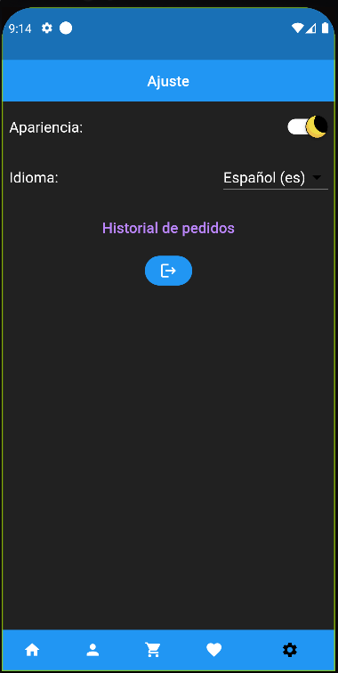

# Mock Digital Store Front made with Flutter/Dart and Firebase.
## Creators: 
- Gowtham Rajendra, [Github](https://github.com/GowthamRajendra)
- Ivan Wang, [Github](https://github.com/Ivan-WangJianBin)
- Ravi Pogaku, [Github](https://github.com/Ravi-Pogaku)

## Table of Contents
- [Sign In/Up](#sign-insign-up-screen-using-firebase-authentication)
- [Homepage](#home-page)
- [Search Bar](#search-bar)
- [Product Page](#product-page)
- [Category Product View](#all-products-in-category)
- [Profile Page](#profile-page-user-data-stored-using-firestore)
- [Shopping Cart](#shopping-cart-user-shopping-cart-stored-using-firestore)
- [Checkout Page](#checkout-page)
- [Order History](#order-history-page)
- [Delivery Notification](#delivery-notification)
- [Track Order on Map](#tracking-your-order-map-via-mapbox)
- [Wish list](#wish-list-user-wishlist-stored-using-firestore)
- [Settings Page](#settings-page)
- [Localizations](#localizations)
- [Launcher Icon](#launcher-icon)
- [Splash Icon](#splash-screen)
- [Citations](#icon-sources)

## Sign In/Sign Up Screen using Firebase Authentication

 
[Back to Top](#mock-digital-store-front-made-with-flutterdart-and-firebase)

## Home page

Product data was scraped from amazon.ca using beautiful soup 
[Back to Top](#mock-digital-store-front-made-with-flutterdart-and-firebase)

## Search bar

 
[Back to Top](#mock-digital-store-front-made-with-flutterdart-and-firebase)

## Product page
 
[Back to Top](#mock-digital-store-front-made-with-flutterdart-and-firebase)

## All products in category
 
[Back to Top](#mock-digital-store-front-made-with-flutterdart-and-firebase)

## Profile page, user data stored using Firestore
 
[Back to Top](#mock-digital-store-front-made-with-flutterdart-and-firebase)

## Shopping cart, user shopping cart stored using Firestore
 
[Back to Top](#mock-digital-store-front-made-with-flutterdart-and-firebase)

## Checkout Page
 
[Back to Top](#mock-digital-store-front-made-with-flutterdart-and-firebase)

## Order History Page

 
[Back to Top](#mock-digital-store-front-made-with-flutterdart-and-firebase)

## Delivery notification
 
[Back to Top](#mock-digital-store-front-made-with-flutterdart-and-firebase)

## Tracking your order map via MapBox
 
[Back to Top](#mock-digital-store-front-made-with-flutterdart-and-firebase)

## Wish list, user wishlist stored using Firestore
 
[Back to Top](#mock-digital-store-front-made-with-flutterdart-and-firebase)

## Settings page

 
[Back to Top](#mock-digital-store-front-made-with-flutterdart-and-firebase)

## Localizations
 
[Back to Top](#mock-digital-store-front-made-with-flutterdart-and-firebase)
### Spanish Example

 
[Back to Top](#mock-digital-store-front-made-with-flutterdart-and-firebase)

## Launcher icon
 
[Back to Top](#mock-digital-store-front-made-with-flutterdart-and-firebase)

## Splash screen
 
[Back to Top](#mock-digital-store-front-made-with-flutterdart-and-firebase)

# Icon Sources
- Light Mode Icon: <a href="https://www.flaticon.com/free-icons/light-mode" title="light mode icons">Light mode icons created by bsd - Flaticon</a>
- Dark Mode Icon: <a href="https://www.flaticon.com/free-icons/moon" title="moon icons">Moon icons created by Freepik - Flaticon</a>

# Citations
- https://github.com/Imperial-lord/mapbox-flutter - Map Routes, Address Search Bar
- https://www.youtube.com/@JohannesMilke - Used multiple tutorials from this channel
- https://stackoverflow.com
- https://github.com/CSCI4100U/LectureExamples2022  
[Back to Top](#mock-digital-store-front-made-with-flutterdart-and-firebase)
